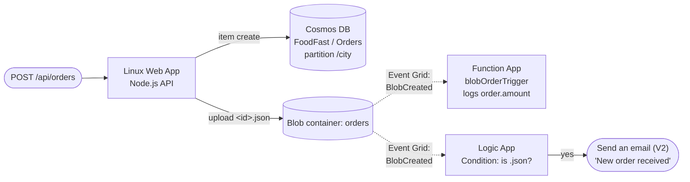

# Deploying FoodFast

Architecture: a Node.js API on a Linux Web App writes orders to Cosmos DB and to a blob container;
a blob-triggered Function App (Event Grid source) logs the order amount; a Logic App on the same
container emails ops when a `.json` order file lands.



Subscription: **AzureTraining**. Resource group: **Training-Batch-6.23** (pre-existing, shared —
Terraform reads it as a data source, not creating it). Azure DevOps project:
**training-proj** (org `324DSTraining`). Single environment — no staging/production split.

## One-time setup

### 0. Grant the AzureTraining service principal RBAC-assignment rights

Confirmed on a real apply (build 266): the service principal behind the `AzureTraining` ARM
service connection can create almost everything in this stack, but gets a 403
(`AuthorizationFailed`) on `Microsoft.Authorization/roleAssignments/write` — it can't create the
two role assignments this stack needs (`Key Vault Secrets Officer` for itself on the new Key
Vault, `Storage Blob Data Contributor` for the Web App's managed identity on the new storage
account). Someone with sufficient rights on `Training-Batch-6.23` (e.g. Syed Ahsan, who created
the `AzureTraining` connection) needs to grant the SPN (object id `5e98d324-e379-4502-a6fb-73fc5439ed2c`)
**User Access Administrator** (or equivalent) scoped to that resource group before `terraform
apply` can complete cleanly. Until then, expect those two `azurerm_role_assignment` resources -
and anything that depends on them (Key Vault secrets, the Web App's blob write access) - to fail
on every apply, even though the rest of the stack succeeds.

### 1. Terraform remote state

State lives in the existing shared storage account, in its own key. The `tfstate` container turned
out **not** to already exist in `olalekog` (confirmed on a real `foodfast-infra-deploy` run —
`terraform init` failed with `ContainerNotFound`, contradicting the original assumption that other
projects' use of that container meant it was already there), so `pipelines/infra-deploy.yml`'s
Plan stage creates it idempotently (`az storage container create`) before every `terraform init` —
no manual step needed. If running the bootstrap apply locally (step 2) before the pipeline ever
runs, create it yourself first:

```bash
az storage container create -n tfstate --account-name olalekog
```

```bash
cd infra/terraform
cp backend.hcl.example backend.hcl        # already points at Training-Batch-6.23 / olalekog
cp terraform.tfvars.example terraform.tfvars   # fill in ops_notification_email
```

### 2. First apply (local, one-time bootstrap)

```bash
az login
az account set --subscription "AzureTraining"
terraform init -backend-config=backend.hcl
terraform plan -out=tfplan
terraform apply tfplan
```

This provisions the storage account + `orders` container, the RBAC-authorized Key Vault (with
`cosmosPrimaryKey`/`cosmosEndpoint` secrets), the serverless Cosmos account/database/container,
the Linux Web App, the Function App, the Event Grid system topic + two subscriptions, and the
Logic App workflow (including an **unauthorized** Office 365 API connection shell — Terraform
cannot supply OAuth consent).

### 3. Authorize the Office 365 connection

In the Azure Portal: **Training-Batch-6.23 → office365 (API Connection) → Edit API connection →
Authorize** → sign in with the account that should send the notification emails → **Save**.

The Logic App's `Condition-Is-JSON` action resource may fail to apply cleanly until this is done
(a known `azurerm_api_connection` limitation — see
[hashicorp/terraform-provider-azurerm#22191](https://github.com/hashicorp/terraform-provider-azurerm/issues/22191)).
After authorizing, re-run:

```bash
terraform apply
```

with no config changes — it should now reconcile successfully.

### 4. Verify (and if needed, replace) the email action's JSON

The `azurerm_logic_app_action_custom.is_json` body in `infra/terraform/logic_app.tf` includes a
best-effort "Send an email (V2)" action shape. Connector operation schemas aren't fully pinned by
documentation alone, so if the action doesn't fire correctly: open the Logic App in the **Portal
Designer** (now that the connection is authorized), add a "Send an email (V2)" action manually
inside the condition's Yes branch with the same Subject/Body, switch to **Code view**, copy the
generated action JSON, and paste it into `logic_app.tf` in place of the placeholder — then
`terraform apply` again so Terraform owns it going forward.

### 5. Azure DevOps pipelines — partial

Pipeline definitions live in **training-proj**, created via `az pipelines create` against the
existing `github.com_Olalekog` GitHub service connection (no new connection needed). The original
5 (ids 33/34/35/36/37) were deleted outside this session while troubleshooting; current state:

| Pipeline name | ID | YAML file | Trigger | Status |
|---|---|---|---|---|
| `foodfast-infra-deploy` | 39 | `pipelines/infra-deploy.yml` | push to `main`, path `infra/terraform` | recreated, being tested |
| `Olalekog.food-delivery-startup` | 38 | `pipelines/api-build.yml` | push to `main`, path `apps/api` | exists |
| `foodfast-api-release` | — | `pipelines/api-release.yml` | on the API build pipeline's completion | not yet recreated |
| `Olalekog.food-delivery-startup-function` | — | `pipelines/function-build.yml` | push to `main`, path `apps/function` | not yet recreated |
| `foodfast-function-release` | — | `pipelines/function-release.yml` | on the function build pipeline's completion | not yet recreated |

The two build pipelines are named to exactly match the `source:` values already in
`api-release.yml`/`function-release.yml` — no YAML edits needed. If a pipeline is ever renamed,
update the matching `source:` field to match, since Azure DevOps wires completion triggers by
exact pipeline name.

Confirmed via `az pipelines agent list --pool-id 11`: the self-hosted agent **OGOGUNDARE** is
registered in the `self-hosted` pool exactly as the app pipeline YAML assumes — no changes needed.
It showed `offline` at setup time, so app-pipeline runs will queue until that agent process is
running again.

### 6. Library variable group for infra-deploy.yml — done

Both `backend.hcl` and `terraform.tfvars` are gitignored (the latter holds a real email address),
so `foodfast-infra-deploy`'s Plan and Apply stages generate them at runtime from a Library
variable group instead of expecting checked-out files or hardcoding values in the YAML.

Variable group **`foodfast`** (id 18) exists, authorized for all pipelines, holding:

| Variable | Value | Secret? |
|---|---|---|
| `resourceGroupName` | `Training-Batch-6.23` | no |
| `storageAccountName` | `olalekog` | no |
| `tfstateContainerName` | `tfstate` | no |
| `tfstateKey` | `foodfast.tfstate` | no |
| `opsNotificationEmail` | the "New order received" recipient | ✅ |

To change a plain value:

```bash
az pipelines variable-group variable update --group-id 18 --name <variableName> --value <newValue>
```

To change the secret recipient:

```bash
az pipelines variable-group variable update --group-id 18 --name opsNotificationEmail \
  --secret true --prompt-value true   # reads AZURE_DEVOPS_EXT_PIPELINE_VAR_opsNotificationEmail
```

### 7. Library variable group for api-release.yml — done

Variable group **`foodfast-api`** (id 19) exists, authorized for all pipelines, holding:

| Variable | Value | Secret? |
|---|---|---|
| `webAppName` | `foodfast-api-ogogundare` | no |
| `keyVaultName` | `kv-foodfast-ogogundare` | no |

### 8. Library variable group for function-release.yml — done

Variable group **`foodfast-function`** (id 20) exists, authorized for all pipelines, holding:

| Variable | Value | Secret? |
|---|---|---|
| `functionAppName` | `foodfast-orders-fn-ogogundare` | no |

`azureSubscription`/`azureServiceConnection` is hardcoded as a literal in all three deployment
pipelines (`infra-deploy.yml`, `api-release.yml`, `function-release.yml`) and deliberately kept
out of these variable groups — confirmed on a real pipeline run that Azure DevOps' service-
connection authorization check matches the task input's literal string and does not expand
`$(var)`/variable-group values before doing that lookup, so a variable-sourced value fails with
"service connection ... could not be found." This applies to every task type that references a
service connection (`AzureCLI@2` included, not just `AzureWebApp@1`/`AzureFunctionApp@2`/
`AzureKeyVault@2`) — the Azure DevOps Pipeline Preview API does not catch this, since it validates
YAML structure but doesn't run that specific authorization check.

## Ongoing workflow

Push to `main`:

- Changes under `infra/terraform/` trigger `foodfast-infra-deploy`: Plan runs automatically,
  Apply is gated behind a `ManualValidation` approval.
- Changes under `apps/api/` trigger `foodfast-api-build` → `foodfast-api-release`: builds, tests,
  and deploys the API to the Web App, injecting the Cosmos key/endpoint from Key Vault at deploy
  time.
- Changes under `apps/function/` trigger `foodfast-function-build` → `foodfast-function-release`:
  builds and deploys the Function App.

## Proving the chain live

```bash
curl -X POST "https://foodfast-api-ogogundare.azurewebsites.net/api/orders" \
  -H "content-type: application/json" \
  -d '{"id":"order-demo-1","city":"Toronto","customerName":"Jane Doe","amount":42.50,"items":["burger","fries"]}'
```

Within a minute, check:

1. **Cosmos document** — Data Explorer on `cosmos-foodfast-ogogundare` → `FoodFast` → `Orders`, or
   `GET /api/orders` on the API.
2. **Blob** — `orders` container in `stfoodfastogogu`, file `order-demo-1.json`.
3. **Function log** — Function App `foodfast-orders-fn-ogogundare` → `blobOrderTrigger` →
   Monitor/Log stream, entry `Order amount: 42.5`.
4. **Email** — the `ops_notification_email` inbox, subject "New order received".
